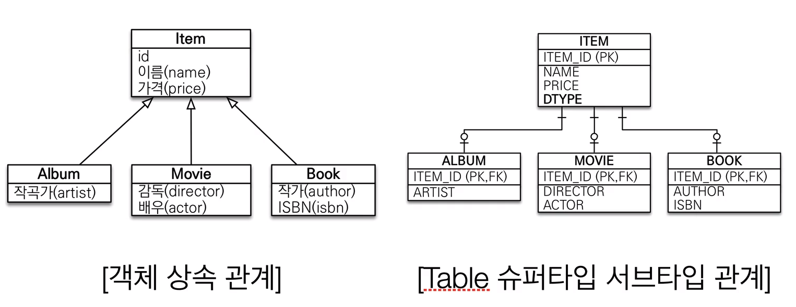
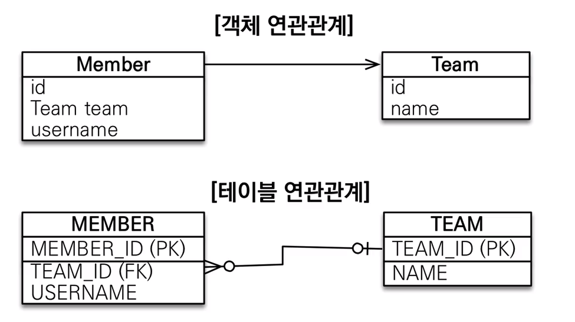
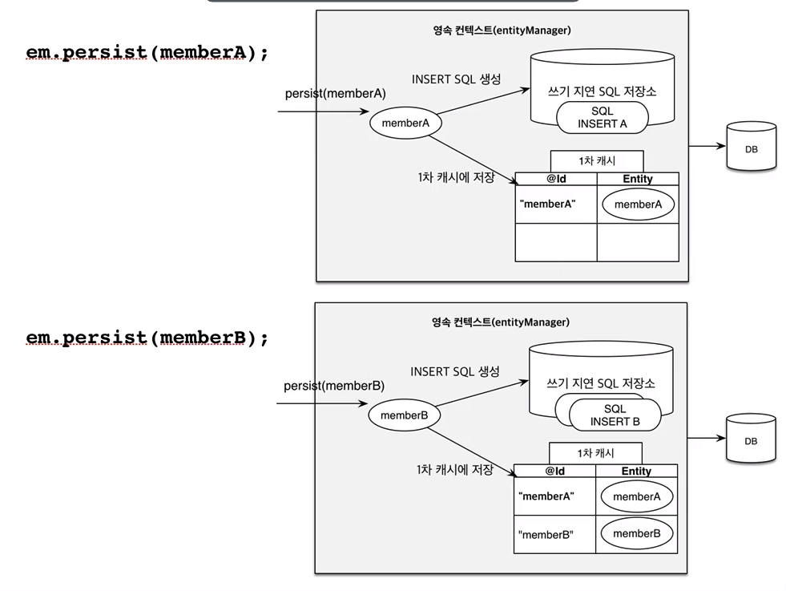
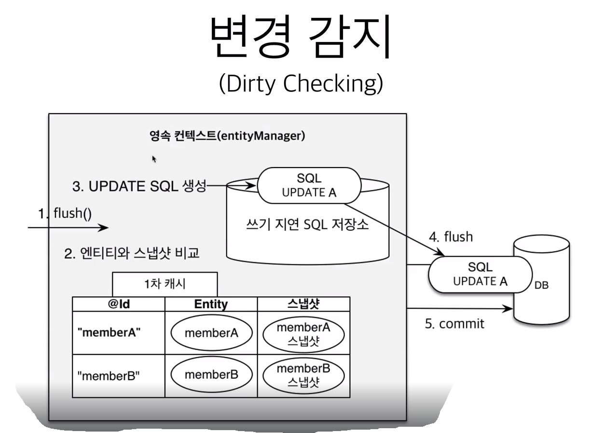
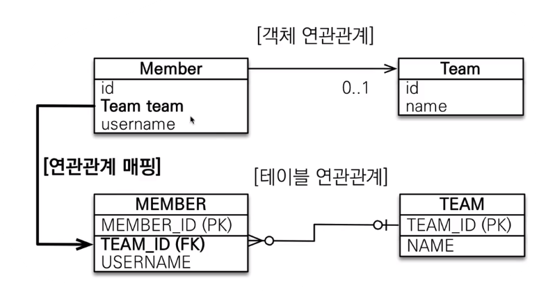
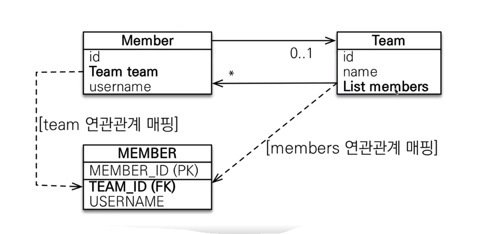
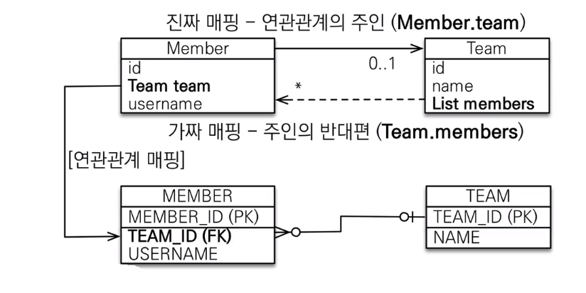

<h1> 섹션1. JPA소개 </h1>
# SQL 중심적인 개발의 문제점

- **반복되며 지루한 코드 개발**
    - CRUD와 관련한 작업을 수행할 때 마다 자바 객체 ↔ SQL 상호 변환하는 코드를 반복 작성해야함.
- **객체에 필드가 추가될 때 마다 연관된 모든 쿼리문을 계속 수정해야함**

{ 객체를 관계형 데이터베이스에 저장하기 위해서 객체를 SQL로 변환하여 저장하게 되는데 **개발자가 SQL Mapper 역할**을 일일이 수행하고 있음. }

## 객체와 관계형 데이터베이스의 차이

### 1. 상속

자바에는 상속관계가 존재하지만 DB에는 존재하지 않음. >> 이를 Table 슈퍼타입 서브타입 관계를 통해 풀어낼 수 있지만 **아래와 같은 문제점**들이 있음.

**데이터에 상속관계가 존재할 시 CRUD에서 굉장히 많은 과정이 생성됨**

예를들어 Album이라는 데이터를 저장한다고 가정을 한다면

1. 객체분해
2. Item 테이블에 데이터 삽입
3. Album 테이블에 데이터 삽입

이라는 3번의 절차가 필요하고, 해당 데이터를 조회한다고 가정하면

1. 각각의 테이블에 따른 조인 SQL작성
2. 각각의 객체(Item, Album) 생성…

위 과정을 비롯하여 많은 절차가 필요하게 됨.

Movie나 Book 데이터를 조회하기 위해서도 Item과의 join SQL이 필요하게 되는 복잡한 과정이 필요함.

**그래서 DB에 저장할 객체에는 상속 관계를 쓰지 않는게 보통.**

### 2. 연관관계

- 객체는 참조를 사용 : `member.getTeam()`
- 테이블은 외래 키를 사용 : `JOIN ON M.TEAM_ID = T.TEAM_ID`

보통 데이터 저장을 위해 SQL쿼리를 작성하게 될 때 FK로 연관관계가 묶여있다고 하면 객체 모델링을 하게 될 때 테이블에 맞춰 **team에 대한 정보가 아닌 team id값으로 모델링**을 함.

→ 객체다운 모델링을 하기 위해서는 `Member.getTeam()`을 통해서 **팀에 대한 정보를 참조할 수 있어야** 하는데 해당 객체가 team 정보를 가지게 될 경우에는 CRUD에 필요한 FK값인 id가 없기 때문에 로직이 복잡해지게 됨.. → FK값을 선행조회 해야하는 번거로움

→ 또한 객체는 자유롭게 **객체 그래프를 탐색**할 수 있어야 함

하지만 처음 실행하는 SQL에 따라 탐색 범위가 결정되기 때문에 엔티티 신뢰 문제가 발생.- 

- 미리 작성한 SQL에 대해 어느정도까지 데이터를 가져오는지 확인하기 위해서는 쿼리를 일일이 다 확인해야함.

만약 하나의 DAO를 통해 모든 정보를 조회하기 위해서는 연관관계로 묶여있는 모든 테이블을 JOIN해야하므로 쿼리문이 복잡해짐.

이를 해결하기 위한 차선책으로 상황에 따라 동일한 조회 메서드를 여러개 생성해놓음.

- member 조회 메서드, team 조회 메서드 등등..

**>> 종합해보면 객체다운 모델링을 하게될수록 SQL Mapping 작업만 늘어남.**

**만약 객체를 자바 컬렉션에 저장 하듯이 DB에 저장하게 된다면 위의 문제들을 한번에 해결이 가능함.**

- DB에서 List처럼 member에 대한 객체를 저장할 수 있게 된다면 CRUD가 훨씬 간단해짐.
- 모든 정보를 담고 있기 때문에 자유로운 객체 그래프 탐색이 가능해짐.

이러한 문제를 해결하기 위해 JPA가 탄생.

---

# JPA 소개

## ORM?

- Object-relational mapping(객체 관계 매핑)
- 객체는 객체대로 설계
- 관계형 데이터베이스는 관계형 데이터베이스대로 설계
- ORM 프레임워크가 중간에서 매핑
- 대중적인 언어에는 대부분 ORM 기술이 존재

**JPA는 표준 명세**

- JPA는 인터페이스의 모음
- JPA 2.1 표준 명세를 구현한 3가지 구현체
- 하이버네이트, EclipseLink, DataNucleus

**JPA 버전**

- JPA 1.0 (2006년) : 초기 버전. 복합 키와 연관관계 기능이 부족
- JPA 2.0 (2009년) : 대부분의 ORM 기능을 포함, JPA Criteria 추가
- JPA 2.1 (2013년) : 스토어드 프로시저 접근, 컨버터, 엔티티 그래프 기능이 추가

## JPA를 왜 사용해야 하는가?

- SQL 중심적인 개발에서 객체 중심으로 개발
- 생산성
- 유지보수
- 패러다임의 불일치 해결
- 성능
- 데이터 접근 추상화와 벤더 독립성
- 표준

### 생산성 - JPA와 CRUD

- 저장 : jpa.persist(member)
- 조회 : Member member = jpa.find(memberId)
- 수정 : member.setName(”변경할 이름”)
- 삭제 : jpa.remove(member)

### 유지보수

기존 : 필드 변경사항이 발생 시 모든 SQL 수정

JPA : 필드만 추가하면 된다. SQL은 JPA가 처리.

### JPA와 패러다임의 불일치 해결

1. **JPA와 상속**

위와 같은 그림에서 JPA는 쿼리의 편리함을 제공

1. **저장** : 기존에는 ITEM과 ALBUM 테이블 두개에 각각 INSERT문을 수행해야 하는데 JPA를 사용 시 persist메서드 하나로 수행.
2. **조회** : JOIN을 사용하여 해당 데이터를 조회해야 했는데, JPA 사용 시 find메서드를 통해 편리하게 조회 수행.

1. **JPA와 연관관계, 객체 그래프 탐색**

```java
member.setTeam(team);
jpa.persist(member);
```

위 로직을 통해 연관관계 저장을 수행

```java
Member member = jpa.find(Member.class, memberId);
Team team = member.getTeam();
```

위 로직을 통해 객체 그래프 탐색

1. **JPA와 비교하기**

jpa.find를 통해 같은 데이터를 조회할 시 두 데이터는 == 연산 시 같음을 보장 (단, 동일한 트랜잭션에 조회한 엔티티에 한정)

### JPA의 성능 최적화 기능

**1차 캐시와 동일성 보장**

1. 같은 트랜잭션 안에서는 같은 엔티티를 반환 - 약간의 조회 성능 향상
2. DB Isolation Level이 Read Commit이어도 애플리케이션에서 Repeatable Read 보장

**트랜잭션을 지원하는 쓰기 지연**

1. 트랜잭션을 커밋할 때까지 INSERT SQL을 모음
2. JDBC BATCH SQL 기능을 사용해서 한번에 SQL 전송

**지연 로딩과 즉시 로딩**

지연 로딩 : 객체가 실제 사용될 때 로딩

즉시 로딩 : JOIN SQL로 한번에 연관된 객체까지 미리 조회

---

# 정리

1. SQL 중심적인 개발의 문제점이 뭐냐?? == SQL Mapper의 문제점이 뭐냐??
mapper에서 resultMap등으로 객체 - SQL결과를 변환하는 코드를 반복 노동해야함.
객체에 필드가 추가? --> 모든 관련 쿼리 긴급수정
2. 애초에 객체와 RDB는 다르다! (With. ORM의 매핑 프레임워크가 필요한 이유!)
    - RDB에는 상속이 없다!
    ->상속문제 해결하려면 객체 분해하고 각각의 테이블에 저장해야하는 번거로움 발생!
    - 연관관계 참조방식이 다르다!
    -> 예시로 RDB에서 FK값을 먼저 얻어야 한번에 연관관계 데이터 조회가 가능하다!

ORM은 이 중간 매핑 과정을 대체

`ORM은 객체와 RDB 두 기둥위에 있는 기술`


---
<h1> 섹션3. 영속성 관리 - 내부 동작 방식
# JPA에서 가장 중요한 2가지

1. 객체와 관계형 데이터베이스 매핑하기
2. **영속성 컨텍스트 (실제 JPA가 내부적으로 어떻게 동작하는지?)**

# 영속성 컨텍스트

JPA를 이해하는데 가장 중요한 용어

**“엔티티를 영구 저장하는 환경”**이라는 뜻

**`EntityManager.persist(entity);`**

영속성 컨텍스트는 논리적인 개념으로 눈에 보이지 않는다.

엔티티 매니저를 통해서 컨텍스트에 접근

## 엔티티의 생명주기

- **비영속**
    - 영속성 컨텍스트와 전혀 관계가 없는 새로운 상태
- **영속**
    - 영속성 컨텍스트에 관리되는 상태
- **준영속**
    - 영속성 컨텍스트에 저장되었다가 분리된 상태
- **삭제**
    - 삭제된 상태

### 비영속

`Member`라는 객체만 생성한 상태를 지칭.

### 영속

`Member`라는 객체를 생성 후 `EntityManager persist`메서드를 사용하여 객체를 저장한 상태를 지칭.

**실제로 데이터베이스에 데이터가 저장되지는 않음.**

### 준영속, 삭제

- `EntityManager.detach(member);`
    - 회원 엔티티를 영속성 컨텍스트에서 분리, 준영속 상태
- `EntityManager.remove(member);`
    - 객체를 삭제한 상태

```java
//비영속
Member member = new Member();
member.setId(100);
member.setName("Beemo");

//영속
EntityManager.persist(member);
//준영속
EntityManager.detach(member);
//삭제
EntityManager.remove(member);
```

## 영속성 컨텍스트의 이점

- **1차 캐시**
- 동일성 보장
- 트랜잭션을 지원하는 쓰기 지연
- **변경 감지**
- **지연 로딩**

### 엔티티 조회, 1차 캐시

엔티티를 영속화시키면(=`persist()` )영속 컨텍스트에 해당 엔티티가 포함이 된다. (= 1차 캐시에 저장됨.)

이 상태에서 `EntityManager.find()` 메서드를 실행시키면 영속 컨텍스트에서 조회를 하게된다. → 1차 캐시에서 조회

만약 1차 캐시에 존재하지 않는(=영속화시키지 않은 엔티티의 경우) 데이터라면 DB조회를 하게 된다.

### 영속 엔티티의 동일성 보장

1차 캐시로 반복 가능한 읽기 등급의 트랜잭션 격리 수준을 데이터베이스가 아닌 애플리케이션 차원에서 제공

**`Member a = em.find(Member.class, “member1”);`**

**`Member b = em.find(Member.class, “member2”);`**

**`System.out.println(a == b)` = 동일성 비교 true**

### 트랜잭션을 지원하는 쓰기 지연

```java
EntityManager em = emf.createEntityManager();

EntityTransaction transaction = em.getTransaction();

//엔티티 매니저는 데이터 변경 시 트랜잭션을 시작해야 한다.

transaction.begin();

em.persist(memberA);
em.persist(memberB);
//여기까지 INSERT SQL을 데이터베이스에 보내지 않는다.

//커밋하는 순간 데이터베이스에 INSERT SQL을 보낸다.
transaction.commit(); //트랜잭션 커밋
```

`persist(memberA)` 메서드 수행 시 영속 컨텍스트 속 1차캐시에 저장됨과 동시에 INSERT SQL을 생성하고 쓰기 지연 SQL저장소에 저장.

`persist(memberB)` 메서드 또한 동일한 수행과정을 거침.

쓰기 지연 SQL 저장소에 저장되있던 SQL들은 transaction.commit() 수행 시 실제 DB에서 수행 된다.

### 변경 감지

```java
//영속
Member member1 = new Member(150L, "A");
Member member2 = new Member(160L, "B");

Member member = em.find(Member.class, 150L);
member.setName("Z");
```

위 코드에서 단순히 Z로 객체의 값만 변경했을 뿐인데 트랜잭션 커밋 시점에 쿼리가 수행되는것을 확인할 수 있다.

내부 매커니즘은 다음과 같다.

`persist()` 메서드를 통해 수정하지말고, 변경 감지 로직을 통해 update 쿼리를 수행하는 것이 맞음.

### 엔티티 삭제

```java
//삭제 대상 엔티티 조회
Member memberA = em.find(Member.class, "memberA");

em.remove(memberA); //엔티티 삭제
```

**트랜잭션 커밋 시점에** 삭제 쿼리가 수행.

## 플러시

영속성 컨텍스트의 변경내용을 **데이터베이스에 반영**

### 플러시 발생 시점

- 변경 감지
- 수정된 엔티티 쓰기 지연 SQL저장소에 등록
- 쓰기 지연 SQL 저장소의 쿼리를 데이터베이스에 전송 (등록, 수정, 삭제 쿼리)

**플러시를 하게 되도 1차 캐시가 없어지지 않음.**

**오직 영속성 컨텍스트 쓰기 지연 SQL 저장소 쿼리들을 DB에 반영되는 과정이 수행됨.**

### 영속성 컨텍스트를 플러시하는 방법

- **em.flush()** : 직접 호출
- **트랜잭션 커밋** : 플러시 자동 호출
- **JPQL 쿼리 실행** : 플러시 자동 호출

### 플러시는!

- 영속성 컨텍스트를 비우지 않음
- 영속성 컨텍스트의 변경내용을 데이터베이스에 동기화
- 트랜잭션이라는 작업단위가 중요 → 커밋 직전에만 동기화 하면 됨.

## 준영속 상태

영속상태 == 영속성 컨텍스트에 1차 캐시에 올라간 상태

1. `em.persist()`
2. `em.find()`

**준영속이란?**

- 영속 → 준영속
- 영속 상태의 엔티티가 영속성 컨텍스트에서 분리
- **영속성 컨텍스트가 제공하는 기능을 사용 못함**

`em.detach()` 메서드를 통해 준영속 상태로 변경 가능

준영속 상태가 되면 **영속성 컨텍스트에서 제거됨.**

`em.clear()` 메서드를 수행 시 영속성 컨텍스트를 통으로 제거.

```java
em.detach(entity); //특정 엔티티만 준영속 상태로 전환
em.clear(); //영속성 컨텍스트를 완전히 초기화
em.close(); //영속성 컨텍스트를 종료
```

# 정리

- JPA에서 가장 중요한 2가지
- 영속성 컨텍스트 상세 내용
- 엔티티의 생명주기
- 비영속, 영속, 준영속, 삭제
- 영속성 컨텍스트의 이점
- 1차 캐시
- 플러시는!
- 지연로딩은 아직 안함.

트랜잭션이 끝날 때 영속성 컨텍스트도 같이 끝나도록 설계해야 데이터 동기화 같은 문제가 발생하지 않음.

**개인적으로 중요하다고 생각되는 점은 다음과 같다.**

1. 영속성 컨텍스트가 무엇인지
2. 엔티티의 생명주기가 어떻게 되는지
3. 영속성 컨텍스트의 이점 중 1차 캐시, 변경 감지


---
<h1>섹션4. 엔티티 매핑</h1>
# 객체와 테이블 매핑

## **@Entity**

- @Entity 어노테이션이 붙은 클래스는 **JPA가 관리**, 엔티티라 한다.
- JPA를 사용해서 테이블과 매핑할 클래스는 **@Entity 필수**
- 주의
    - **기본 생성자 필수**(파라미터가 없는 public 또는 protected 생성자)
    - **final 클래스, enum, interface, inner 클래스 사용 X**
    - **저장할 필드에 final 사용 X**

## @Entity 속성 정리

- 속성 : **name**
    - JPA에서 사용할 엔티티 이름을 지정한다. (**기본값은 클래스 이름**)
    - JPA가 내부적으로 구분하는 이름값.

## @Table

- 엔티티와 매핑할 테이블 지정
    - name 속성 : 매핑할 테이블 이름 (**기본값은 엔티티 이름을 사용**)
    - catalog등 다양한 속성이 있음.

---

# 데이터베이스 스키마 자동 생성

- DDL을 애플리케이션 실행 시점에 자동 생성
    - `ddl-auto: create` 옵션
- 테이블 중심 → 객체 중심
- 데이터베이스 방언을 활용해서 데이터베이스에 맞는 적절한 DDL 생성
- 이렇게 **생성된 DDL은 개발 장비에서만 사용**
    - 운영에서 사용하면 큰일난답니다.
- 생성된 DDL은 운영서버에서는 사용하지 않거나, 적절히 다듬은 후 사용

`hibernate:  ddl-auto: <옵션>`

- **create** : 기존테이블 삭제 후 다시 생성
- **create-drop** : 테이블 drop - create - drop 순으로 실행
    - 테스트케이스 실행 후 깔끔하게 날리고 싶을 때 사용
- **update** : 변경부분만 반영(운영DB에는 사용하면 안됨)
- **validate** : 엔티티와 테이블이 정상 매핑되었는지 확인
- **none** : 사용하지 않음

### 주의할 점

- **운영 장비에서는 절대 validate, none옵션을 제외한 나머지 옵션은 사용하면 안된다.**
- 개발 초기 단계는 create 또는 update
- 테스트 서버는 update 또는 validate
- 스테이징과 운영 서버는 validate 또는 noen

**결론은 로컬서버에서 혼자할 때만 옵션 사용할 것을 권장**

### DDL 생성 기능

- 제약조건 추가 : 회원 이름은 필수, 10자 초과X
    - `@Column(nullable = false, length = 10)`
- 유니크 제약조건 추가
    - `@Table(uniqueConstraints = {@UniqueConstraint(name=”NAME_AGE_UNIQUE”, columnNames={”NAME”, “AGE”} )})`

DDL 생성 기능은 DDL을 자동 생성할 때만 사용되고 **JPA의 실행 로직에는 영향을 주지 않는다.**

---

# 필드와 컬럼 매핑

## 매핑 어노테이션 정리

```java
@Column(name = "user_name")
private String userName;
```

**(제일 중요)**객체이름과 DB컬럼이름을 다르게 사용하고 싶을 때

### 속성 정리

- name ****: 필드와 매핑할 테이블의 컬럼 이름
- insertable, updatable : 등록, 변경 가능 여부 (**기본값 : true**)
    - 필드를 수정했을 때 데이터베이스에 저장 혹은 변경할건지 반영 여부
- **nullable(DDL) : null값의 허용 여부를 설정. false로 설정하면 DDL 생성 시에 not null 제약조건이 붙는다.**
- unique(DDL) : 한 컬럼에 간단히 유니크 제약조건을 걸 때 사용하지만 **잘 사용하지 않음**. (제약조건의 이름이 이상하게 생성되기 때문에)
    - 클래스단에 uniqueConstraints와 같은 어노테이션으로 설정하는게 좋음.
- length : 문자 자료형의 크기를 설정할 때 사용 (String 타입에만 사용)
- columnDefinition(DDL) : 데이터베이스 컬럼 정보를 직접 줄 수 있다.
    - ex) varchar(100), default ‘EMPTY’
- precision, scale(DDL) : BigDecimal 타입에서 사용한다. 아주 큰 수 혹은 소수점을 사용할 때 활용한다.

```java
@Enumrated(EnumType.STRING)
private RoleType roleType;
```

enum객체를 사용하고 싶을 때 사용하는 어노테이션

DB에는 enum타입이 없기 때문에 어노테이션으로 사용해야함.

EnumType.ORDINAL (enum의 순서를 저장, **default**)

EnumType.STRING (enum의 이름을 저장)

**필드가 추가될 때 마다 ORDINAL의 경우 값의 무결성이 깨질 수 있기 때문에 사용하지 않아야함!**

```java
@Temporal(TemporalType.TIMESTAMP)
private Date createdDate;

@Temporal(TemporalType.TIMESTAMP)
private Date createdDate;
```

날짜 타입(java.util.Date, java.util.Calendar)을 매핑할 때 사용

참고 : LocalDate(DATE), LocalDateTime(TIMESTAMP)을 사용할 때는 **생략** 가능(최신 하이버네이트 지원)

```java
@Lob
private String description;
```

큰 용량의 데이터를 데이터베이스에 저장 하고싶을 때 (BLOB, CLOB와 매핑)

```java
@Transient
private int temp;
```

데이터베이스에 해당 컬럼은 없지만 그냥 내부 메모리로만 사용하고 싶을 때

---

# 기본 키 매핑

## 기본 키 매핑 어노테이션

**@Id** : 직접 할당

@GeneratedValue : 자동 생성

- **IDENTITY : 데이터베이스에 위임, MYSQL**
- SEQUENCE : 데이터베이스 시퀀스 오브젝트 사용, ORACLE
    - @SequenceGenerator 필요
- TABLE : 키 생성용 테이블 사용, 모든 DB에서 사용
    - @TableGenerator 필요
- AUTO : 방언에 따라 자동 지정, 기본값

### IDENTITY 전략 - 특징

`@GeneratedValue(strategy = GenerationType.IDENTITY)`

- 기본 키 생성을 데이터베이스에 위임
- 주로 MySQL, PostgreSQL, SQL Server, DB2에서 사용
    - 예 : MySQL의 AUTO_INCREMENT
- JPA는 보통 트랜잭션 커밋 시점에 INSERT SQL 실행
- AUTO_INCREMENT는 데이터베이스에 INSERT SQL을 실행한 이후에 ID값을 알 수 있음
- **IDENTITY 전략은 em.persist() 시점에 즉시 INSERT SQL실행하고 DB에서 식별자를 내부적으로 조회**
    - .getId() 메서드를 통해 조회해보면 값이 나오는걸 확인할 수 있음.

`@GeneratedValue(strategy = GenerationType.SEQUENCE)`

int형은 안되고 Long타입을 사용해야함.

Oracle에서의 AUTO_INCREMENT!

Oracle에서 사용되므로 확인 용도로만!

SEQUENCT방식은 쿼리 지연 버퍼링 활용 가능! PK값 조회가능하다는 뜻!

### TABLE 전략

- 키 생성 전용 테이블을 하나 만들어서 데이터베이스 시퀀스를 흉내내는 전략
    - 어디는 AUTO_INCREMENT, 어디는 SEQUENCE를 사용하는 경우에
- 장점 : 모든 데이터베이스에 적용 가능
- 단점 : 성능 (쓸데없는 테이블이 키를 위해서 하나 생성되므로)

매핑은 SEQUENCE와 비슷하게 사용

**TABLE 매핑 전략을 잘 사용하지 않음!**

### 권장하는 식별자 전략

- 기본 키 제약 조건 : null 아님, 유일, 변하면 안된다.
- 미래까지 이 조건을 만족하는 자연키는 찾기 어렵다. 대리키(대체키&인조키)를 사용하자.
- 예를 들어 주민등록번호도 기본 키로 적절하지 않다.
- **권장 : Long형 + 대체키 + 키 생성전략 사용**

**결론적으로 AUTO_INCREMENT 혹은 UUID 같은 인조키를 PK로 사용해라!**

---

## 데이터 중심 설계의 문제점

나 또한 처음에는 DB 테이블에 있는 컬럼 그대로 객체를 연관시켜 생성하면 되지 않을까? 라는 생각을 했지만 문제점이 있다.

- 객체 설계를 테이블 설계에 맞춘 방식
- 테이블의 외래키를 객체에 그대로 가져옴
- 객체 그래프 탐색이 불가능
    - Orders.getMemeber.getMemberId()가 안됨
- 참조가 없으므로 UML도 잘못됨

---
<h1> 섹션5. 연관관계 매핑 기초 </h1>
# 목표

- 객체와 테이블 연관관계의 차이를 이해 (섹션 1에서 했던 부분)
- 객체의 참조와 테이블의 외래 키를 매핑
- 용어 이해

# 연관관계가 필요한 이유

‘객체지향 설계의 목표는 자율적인 객체들의 협력 고통체를 만드는 것이다.’

## 객체를 테이블에 맞추어 데이터 중심으로 모델링하면, 협력 관계를 만들 수 없다.

- 테이블은 **외래 키로 조인**을 사용해서 연관된 테이블을 찾는다.
- 객체는 **참조**를 사용해서 연관된 객체를 찾는다.
- 테이블과 객체 사이에는 이런 큰 간격이 있다.

# 단방향 연관관계

```java
@ManyToOne //다대일
@JoinColumn(name = "컬럼명")
private Team team;
```

위 두 가지의 어노테이션만으로 단방향 연관관계 매핑을 할 수 있다.

# 양방향 연관관계와 연관관계의 주인

```java
private Long id;
private String name;
@OneToMany(mappedBy = "team")
private List<Member> members = new ArrayList<>();
```

어노테이션 및 List 멤버변수만 추가하는 것으로 양방향 연관관계를 형성할 수 있음

## 연관관계의 주인과 mappedBy

- **mappedBy** = JPA의 멘탈붕괴 난이도 (ㄷㄷ…)
- **mappedBy**는 처음에는 이해하기 어렵다.
- **객체와 테이블간에 연관관계를 맺는 차이**를 이해해야 한다.

### **객체와 테이블간에 연관관계를 맺는 차이**

- **객체 연관관계 = 2개**
    - 회원 → 팀 연관관계 1개(단방향) = Team Type
    - 팀 → 회원 연관관계 1개(단방향) = List
- **테이블 연관관계 = 1개**
    - 회원 ↔ 팀의 연관관계 1개(양방향) = **FK**

### 객체의 양방향 연관관계

- 객체의 양방향 관계는 **사실 양방향 관계가 아니라 서로 다른 단방향 관계 2개**이다.
- 객체를 양방향으로 참조하려면 단방향 연관관계를 2개 만들어야 한다.

### 테이블의 양방향 연관관계

- 테이블은 외래 키 하나로 두 테이블의 연관관계를 관리
- MEMBER.TEAM_ID 외래 키 하나로 양방향 연관관계 가짐(양쪽으로 조인할 수 있다.)

위와 같은 상황에서 값의 변경이 이루어져야할 때 Member의 team값을 변경해야하는지 Team의 member값을 변경해야하는지 혼동이 올 수 있다.

양방향이 되면서 Team에 있는 members 값도 변경을 해야하는 상황이 발생.

MEMBER테이블의 TEAM_ID라는 외래 키를 어떻게 변경해야하지?

⇒ 둘 중 하나로 외래키를 관리해야함. (연관관계의 주인을 정해라)

## 연관관계의 주인(Owner)

**양방향 매핑 규칙**

- 객체의 두 관계 중 하나를 연관관계의 주인으로 지정
- 연관관계의 주인만이 외래 키를 관리(등록, 수정)
- **주인이 아닌쪽은 읽기만 가능**
- 주인은 mappedBy 속성 사용 X
- 주인이 아니면 mappedBy 속성으로 주인 지정

Member의 team이 주인이 되거나

Team의 List<members>가 주인이 되거나

## 누구를 주인으로?

- **외래 키가 있는 곳을 주인으로 정해라**
- 여기서는 Member.team이 연관관계의 주인

DB테이블상에서 외래키는 MEMBER 테이블에 있음(TEAM_ID(FK)) ⇒ Member Entity가 주인이 됨.

- 연관관계 주인 정리
    
    결국 DB는 연관관계를 변경할 때 하나의 컬럼만 변경해야 하는데, 객체는 2개의 필드를 변경하니 이 사이에서 문제가 될 수 있다.
    
    그렇기 때문에 연관관계의 주인을 설정하여 한 객체만 실제로 테이블과 매핑하고 나머지 객체는 매핑된 객체로부터 미러링된 내용을 읽기전용으로 사용한다.

## 양방향 매핑 시 가장 많이 하는 실수

**연관관계의 주인에 값을 입력하지 않음.**

`team.getMembers().add(member);` 를 수행하여 UPDATE를 진행해도 DB상에는 반영되지 않는다.

왜냐하면 team Entity의 members는 mappedBy로 읽기전용으로 사용하고 있기 때문.

따라서 `Member.setTeam(새로운 team객체)`을 통해서 UPDATE를 진행해야 실제 DB에 반영이 된다.

**순수한 객체 관계를 고려하면 항상 양쪽 다 값을 입력해야 한다.**

team Entity의 members에도 추가

member Entity의 team에도 추가

안해도되지만 객체지향적으로 양쪽에 다 값을 추가하는게 옳은 개발방식이다.

team의 members를 추가안해주었을 때 문제점

- team객체를 생성했을 때 영속 컨텍스트 1차 캐시에 들어가있기 때문에 조회를해도 나오지 않음.
    - Collection에는 추가하지 않았기 때문에 아무것도 없는 순수 객체 상태.
    - 1차 캐시에 team이라는 데이터가 있기 때문에 select 쿼리가 추가적으로 발생하지 않음.

결론 : 양방향 연관관계 생성 시 양쪽에 값을 전부 세팅해야한다.

- 순수 객체 상태를 고려해서 항상 양쪽에 값을 설정하자
- 연관관계 편의 메소드를 생성하자
    - **Member의 setTeam 세터 메서드에 team Entity의 members값도 자동으로 추가되게끔!**
    - 추가 팁으로 세터의 역할만하는 메서드가 아니라면 setTeam이라는 메서드 이름이 아닌 changeTeam같은 특별한 메서드로 이름을 설정하자.
    - 메서드를 생성할 때 주인쪽에서 생성할지 주인 반대편쪽에서 생성할지는 정하고!
- **양방향 매핑시에 무한 루프를 조심하자**
    - toString(), lombok, JSON 생성 라이브러리
- 왜 무한루프가?
    
    **toString()**
    
    Member와 Team Entity에 모두 toString()이 있다면 서로가 서로를 호출하게됨.
    
    왜냐하면 toString()이 상대편 객체의 toString을 호출하는 로직이기 때문에
    
    **JSON 생성 라이브러리**
    
    엔티티를 컨트롤러에서 반환할 때 Team에 Member가 있기 때문에 Member를 JSON으로 변환하고 Member에 Team이 있기 때문에 Team을 JSON으로 변환하면서 무한루프가 발생!
    
    **해결법**
    
    toString()을 사용하지마라! 웬만하면!
    
    컨트롤러에서 Entity를 절대 반환하지마라! ⇒ DTO로 변환해서 반환
    
    또한 Entity를 반환하게 될 경우 Entity 필드가 변경되는 순간 API 스펙이 변경되는 것 때문!


# 양방향 매핑 정리

- **단방향 매핑만으로도 이미 연관관계 매핑은 완료**

단방향 매핑만으로 설계를 해라!

양방향 매핑이 필요한 순간 잘못된 설계다!

- 양방향 매핑은 반대 방향으로 조회(객체 그래프 탐색) 기능이 추가된 것 뿐
- JPQL에서 역방향으로 탐색할 일이 많음
- 단방향 매핑을 잘 하고 양방향은 필요할 때 추가해도 됨 (테이블에 영향을 주지 않음)

**연관관계의 주인을 정하는 기준**

- 비즈니스 로직을 기준으로 연관관계의 주인을 선택하면 안됨
- **연관관계의 주인은 외래 키의 위치를 기준으로 정해야함**