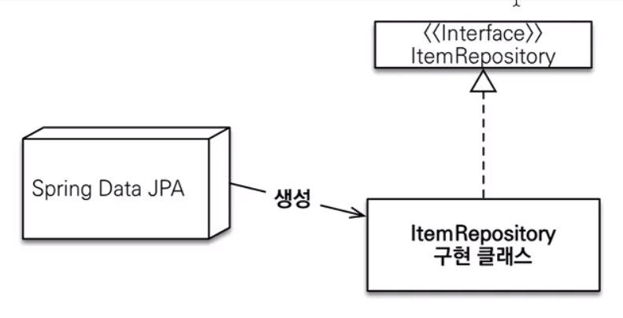
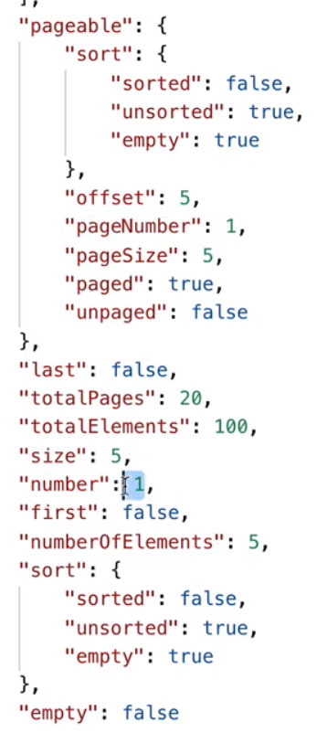

# 실전 스프링

- 목차

# 순수 JPA

### 문제점

매번 똑같은 CRUD 구문들을 반복적으로 작성해야 하는 귀찮음이 있었음.

- save
- delete
- findById
- count 등등..

이러한 반복적인 코드를 어떻게 줄일까하는 고민 끝에 인터페이스로 해결하는 오픈소스가 탄생.

해당 오픈소스 개발자와 스프링의 협업이 이루어지며 스프링 데이터 JPA가 탄생함.

# 스프링 데이터 JPA

기존 공통 인터페이스 설정을 스프링 부트 사용시 해줄 필요가 없다.

**아래 사진과 같이 스프링 데이터 JPA가 구현 클래스를 대신 생성해주기 때문**



자바의 프록시 기능 활용

## 주요 메서드

- `save(S)` : 새로운 엔티티는 저장하고 이미 있는 엔티티는 병합.
- `delete(T)` : 엔티티 하나를 삭제한다.
- `findById(ID)` : 엔티티 하나를 조회한다.
- `getOne(ID)` : 엔티티를 프록시로 조회한다. 내부에서 `em.getReference()` 호출
- `findAll(…)` : 모든 엔티티를 조회한다. 정렬이나 페이징 조건을 파라미터로 제공할 수 있다.

---

# 쿼리 메서드

## 메서드 이름으로 쿼리 생성

### 기존 순수 JPA

```java
public List<Member> findByUsernameAndAgeGreaterThen(String username, int age) {
	return em.createQuery("select m from Member m where m.username = :username and m.age > :age")
				.setParameter("username", username)
				.setParameter("age", age)
				.getResultList();
}
```

### 스프링 데이터 JPA

```java
List<Member> findByUsernameAndAgeGreaterThen(String username, int age);
```

UsernameAndAgeGreaterThan이라는 메서드명 규칙을 통해 쿼리를 생성 및 실행.

조금이라도 규칙과 엇나가면 에러발생. → `ReferenceException(No Property)`

규칙과 관련된 메뉴얼 → 스프링 데이터 공식문서 참조.

**쿼리 메서드 필터 조건**

https://docs.spring.io/spring-data/jpa/reference/repositories/query-keywords-reference.html#appendix.query.method.predicate

**문제점**

And 이외에 조건이 추가될 때 마다 메서드 명이 너무 길어짐.

2개 넘어가면 다른 쿼리 메서드말고 다른 방법으로 작성.

**스프링 데이터 JPA가 제공하는 쿼리 메서드 기능**

- **조회** : find…By, read…By, query…By, get…By
  - 예 : findHelloBy처럼 …에 식별하기 위한 내용(설명)이 들어가도 된다.
- **COUNT** : count…By
  - 반환타입 ; `long`
- **EXISTS** : exists…By
  - 반환타입 : `boolean`
- **삭제** : delete…By, remove…By
  - 반환타입 : `long`
- **DISTINCT** : findDistinct, findMemberDistinctBy
- **LIMIT** : findFirst3, findFirst, findTop, findTop3

참고 : 이 기능은 엔티티의 필드명이 변경되면 인터페이스에 정의한 메서드 이름도 꼭 변경해야한다. 그렇지 않으면 애플리케이션을 시작하는 시점에 오류가 발생한다.

이렇게 애플리케이션 로딩 시점에 오류를 인지할 수 있는 것이 스프링 데이터 JPA의 매우 큰 장점이다.

## JPA NamedQuery

실무에서 사용할 일이 거의 없는 기능.

```java
@NamedQuery(name="Member.findByUsername", query="select m from Member m where m.username=:username")

@Query(name = "Member.findByUsername")

```

엔티티 클래스에서 @NamedQuery 애노테이션을 사용하여 쿼리를 사전 선언.

@Query를 통해 NamedQuery를 탐색하여 해당하는 쿼리를 실행.

하지만 @Query를 안붙여도 NamedQuery를 먼저 탐색하기 때문에 같은 로직이 실행됨.

또한 NamedQuery도 없어도 쿼리메서드를 통한 실행이 정상적으로 이루어짐.

스프링 데이터 JPA에서 레포지토리의 메서드에 쿼리를 바로 지정할 수 있는 기능이 있기 때문에 NamedQuery를 실무에서 사용할 일이 별로 없다.

**기존 JPQL로 생성한 쿼리문의 경우 단순 String이기 때문에 애플리케이션 실행 시점에 오류가 발생하지 않지만, NamedQuery의 경우에는 애플리케이션 로딩 시점에 문법 오류를 체크해주는 장점이 있다. → NamedQuery는 로딩 시점에 SQL 쿼리를 파싱해놓기 때문에**

## @Query, 레포지토리 메서드에 쿼리 정의하기

NamedQuery에 비해서 실무에서 자주 사용하는 기능

레포지토리 인터페이스단에서 메서드 위 애노테이션을 통해서 쿼리를 바로 지정해줄 수 있음.

```java
@Query("select m from Member m where m.username = :username and m.age = :age")
List<Member> findUser(@Param("username") String username, @Param("age") int age);
```

**장점**

1. 메서드명이 길어지는 쿼리메서드에 비해 간결하게 작성 가능하다.
2. 쿼리의 잘못된 부분을 로딩 시점에 체크하기 때문에 사전에 오류를 찾을 수 있다.

**정리**

간단한 기능같은 경우에는 쿼리메서드를 통해 작성.

조금 복잡해진다면 레포지토리 메서드에 쿼리 정의를 통해 작성.

## @Query, 값, DTO 조회하기

**DTO로 값 조회**

```java
@Query("select new com.ssafy.study.dto.MemberDto(m.id, m.username, t.name) from Member m join m.team t")
```

마치 객체 생성자를 쓰듯 new Operation을 사용해야함. (풀 패키지명 작성)

## 파라미터 바인딩

- 위치 기반
- 이름 기반

````java
```sql
select m from Member m where m.username = ?0 //위치 기반
select m from Member m where m.username = :name //이름 기반
````

웬만하면 위치기반 말고 이름 기반 바인딩을 사용하자.

**컬렉션 파라미터 바인딩**

```java
@Query("select m from Member m where m.username in :names")
	List<Member> findByNames(@Param("names") Collection<String> names);
```

## 반환 타입

스프링 데이터 JPA는 유연한 반환 타입 지원

```java
List<Member> findByUsername(String name); //컬렉션
Member findByUsername(String name); //단건
Optional<Member> findByUsername(String name); //단건
```

- 컬렉션 조회 시 데이터가 없을 경우 List<Member>에는 null이 아니라 empty Collection을 반환
- 단건 조회 시 데이터가 없을 경우 결과는 null

JPA의 경우 getSingleResult()시 데이터가 없다면 no result Exception을 발생시키는데,

스프링 데이터 JPA의 경우 예외를 터뜨리지 않고 null로 반환.

→ Optional을 활용하면 null로 넘어오더라도 상관없음.

- 단건 조회 시 데이터가 여러 개일 경우에는 `NonUniqueResultException`예외 발생
  - 스프링 데이터 JPA가 해당 에러를 springframework Exception으로 변환
    - 이유는 JDBC가 달라져도 같은 예외를 터뜨리기 위함.

이 외에도 다양한 반환 타입이 존재

https://docs.spring.io/spring-data/jpa/reference/repositories/query-return-types-reference.html#appendix.query.return.types

# 순수 JPA 페이징과 정렬

JPA에서 페이징을 어떻게 할 것인가?

다음 조건으로 페이징과 정렬을 사용하는 예제 코드를 보자

- 검색 조건 ; 나이가 10살
- 정렬 조건 : 이름으로 내림차순
- 페이징 조건 : 첫 번째 페이지, 페이지당 보여줄 데이터는 3건

**JPA페이징 레포지토리 코드**

```java
public List<Member> findByPage(int age, int offset, int limit) {
	return em.createQuery("select m from Member m where m.age = :age order by m.username desc")
		.setParameter("age", age)
		.setFirstResult(offset)
		.setMaxResults(limit)
		.getResultList();
}
public long totalCount(int age) {
	return em.createQuery("select count(m) from Member m where m.age = :age", Long.class)
		.setParameter("age", age)
		.getSingleResult();
```

# 스프링 데이터 JPA 페이징과 정렬

**페이징과 정렬 파라미터**

- `org.springframework.data.domain.Sort` : 정렬 기능
- `org.springframework.data.domain.Pageable` : 페이징 기능 (내부에 Sort 포함)

**특별한 반환 타입**

- [`org.springframework.data.domain.Page`](http://org.springframework.data.domain.Page) : 추가 count 쿼리 결과를 포함하는 페이징
- `org.springframework.data.domain.Slice` : 추가 count쿼리 없이 다음 페이지만 확인 가능(내부적으로 limit + 1 조회)
  - totalPageCount가 필요없는 경우 (예 : 모바일의 더보기 같은 기능)
- List (자바 컬렉션) : 추가 count 쿼리 없이 결과만 반환

## Page Type

**인터페이스**

```java
Page<Member> findByAge(int age, Pageable pageable);
```

**테스트코드**

```java
//give
memberRepository.save("user1");
..
..
PageRequest pageRequest = PageRequest.of(page:0, size:3, Sort.by(Sort.Direction.DESC, "username"));

//when
page<Member> page = memberRepository.findByAge(age, pageRequest);

//then
List<Member> content = page.getContent();
//long totalCount = memberRepository.totalCount(age);
page.getTotalElements = page.getTotalElements();

page.getNumber(); //page 번호
page.getTotalPages(); // page 개수
page.isFirst(); //첫번째 페이지인지 true or false
page.hasNext(); //다음 페이지가 있는지 true or false
```

스프링 데이터 JPA는 페이징 첫번째가 0번부터 시작

totalCount같은 경우는 지워도 됨. → page 타입으로 반환을 받을 경우 findByAge메서드에서 totalCount쿼리까지 같이 수행하기 때문에.

## Slice Type

**인터페이스**

```java
Slice<Member> findByAge(int age, Pageable pageable);
```

반환 Type Slice로 수정

**테스트코드**

```java
PageRequest pageRequest = PageRequest.of(page:0, size:3, Sort.by(Sort.Direction.DESC, "username"));

//when
Slice<Member> slice = memberRepository.findByAge(age, pageRequest);

//then
List<Member> content = page.getContent();

//page.getTotalElements(); //요소의 총 개수
page.getNumber(); //page 번호
//page.getTotalPages(); // page 개수
page.isFirst(); //첫번째 페이지인지 true or false
page.hasNext(); //다음 페이지가 있는지 true or false
```

주석된 부분은 제공되지 않는 기능

**TotalCount 쿼리가 추가로 수행되지 않음!**

size를 3개로 설정해도 Slice의 경우 1개 더 추가해서 조회함.

## TotalCount 쿼리 최적화

```java
@Query(value = "select m from Member m", countQuery = "select count(m.username) from Member m")
page<Member> findByAge(int age, Pageable pageable);
```

TotalCount의 경우 join할 필요가 없는 경우가 많은데 제공되는 메서드 기능을 사용하면 Count쿼리에도 join구문이 함께 나가게 됨.

이를 최적화 하기위해 count쿼리만 별도로 분리하는 기능을 스프링 데이터JPA에서 제공함.

## page Type to DTO

page타입을 그대로 컨트롤러에서 클라이언트로 반환하면 엔티티를 반환하는 것이 되기 때문에 API 스펙이 바뀌는 대참사를 방지하려면 DTO로 변환해서 반환해야함.

다음은 page to DTO 변환 코드입니다.

```java
page<MemberDto> toMap = page.map(member -> new MemberDto(member.getId(), member.getUsername(), null));
```

page<MemberDto> toMap의 경우에는 컨트롤러에서 반환해도 됩니다.

이유는 내부 데이터가 DTO이기 때문에.

---

# 벌크성 수정 쿼리

한번에 많은 데이터의 변경을 일괄적으로 이루어야하는 쿼리.

**순수 JPA**

```java
public int bulkAgePlus(int age) [
	return resultCount = em.createQuery("update Member m set m.age = m.age + 1 where m.age >= :age")
		.setParameter("age", age)
		.executeUpdate();
}
```

**스프링 데이터 JPA**

```java
@Modifying //변경 쿼리 인지를 인식시키는 어노테이션
@Query("update Member m set m.age = m.age + 1 where m.age >= :age")
int bulkAgePlus(@Param("age") int age);
```

Modifying 어노테이션을 빼면 에러가 발생

**벌크 연산은 영속성 컨텍스트를 무시하고 DB로 바로 다이렉트로 가기 때문에 서로 안맞을 수 있음 (영속 컨텍스트 ↔ DB)**

**예시코드**

기존 member5의 나이는 40살이였고, 위와 같은 벌크성 쿼리를 수행 후 조회할 경우를 가정

```java
Member result = memberRepository.findByUsername("member5");
System.out.println(result.getAge()); //
```

결과는 40살일까 ? 41살일까?

== 40살

어떻게 해결할까?

**벌크 연산 수행 직후에는 영속 컨텍스트를 초기화!**

```java
@PersistenceContext
EntityManager em;

벌크 연산 직후 ..
em.flush();
em.clear();
```

스프링 데이터 JPA는 해당 기능을 제공

```java
@Modifying(clearAutomatically = true)
@Query("update Member m set m.age = m.age + 1 where m.age >= :age")
int bulkAgePlus(@Param("age") int age);
```

`clearAutomatically = true` 옵션이 자동으로 영속 컨텍스트를 초기화함.

추가

JPQL을 호출할 때는 항상 flush()가 호출된다.

쿼리 호출 시 플러시가 자동으로 호출되어 Insert 쿼리가 실행된다.

JPQL 실행 시 관련 있는 엔티티만 플러시하는 최적화 기능?

질문 : UPDATE 벌크성 쿼리 직후 member5를 조회하면 UPDATE이전 데이터가 조회된다.

반대로 DELETE 벌크성 쿼리 직후에는 member5를 조회하면 결과가 어떻게 될까?

예시 코드

```java
public void MethodA() {
	//give
	memberRepository.save(new Member("member1", 10);
	memberRepository.save(new Member("member2", 20);
	memberRepository.save(new Member("member3", 30);
	memberRepository.save(new Member("member4", 40);
	memberRepository.save(new Member("member5", 50);

	//when
	memberRepository.bulkDeleteByUsername("member5");
	Member member = memberRepository.findByUsername("member5");

	//then
	assertThat(member.getUsername().isEqualTo("member5");
}
```

질문 2 : B 서버에서 DB UPDATE 시 A서버의 영속 컨텍스트에 있는 엔티티는 값이 어떻게 되나?

이런 문제에 대해서 해결할 수 있는 방안에 대해 생각나는대로 얘기해주세요.

# @EntityGraph

연관된 엔티티들을 SQL 한번에 조회하는 방법

member → team은 지연로딩 관계이다. 따라서 다음과 같이 team의 데이터를 조회할 때 마다 쿼리가 실행된다. (N+1 문제 발생)

## FetchJoin ?

연관관계가 있는 엔티티를 한번에 조회하면서 객체 그래프를 생성.

**문제상황 가정**

`ManyToOne` 으로 연관관계가 걸려있는 Member엔티티를 조회한 List<Member> member가 있다고 가정하자.

루프를 통해 member를 출력할 때 실제 필드인 Team의 값을 조회하면 지연로딩으로 인한 추가 쿼리가 발생한다.

이 때 루프를 도는 회수만큼 Team 엔티티를 조회하는 쿼리 N개가 발생하게 되어 N+1문제가 발생한다.

**이러한 문제를 FetchJoin을 통해 해결할 수 있다.**

```java
@Query("select m from Member m left join fetch m.team")
List<Member> findMemberFetchJoin();

or

@EntityGraph(attributePaths={"team"})
@Query("select m from Member m")
List<Member> findMemberFetchJoin();
```

JPQL을 작성할 때 join fetch 구문을 통해 멤버를 조회하면서 팀을 동시에 조회할 수 있다.

FecthJoin을 쓰려면 무조건 JPQL을 사용해야하냐?

→ ㄴㄴ EntityGraph 사용 ㄱㄱ

```java
@Override
@EntityGraph(attributePaths={"team"})
List<Member> findAll();
```

FetchJoin을 하면 기본적으로 Left outer join이 나감.

**NamedEntityGraph**

**엔티티 클래스 상단**

```java
@NamedEntityGraph(name = "Member.all", attributeNodes=@NamedAttributeNode("team"))
```

**인터페이스 메서드**

```java
@EntityGraph("Member.all")
List<Member> findMemberFetchJoin();
```

# JPA Hint & Lock

## JPA Hint

JPA 쿼리 힌트(SQL 힌트가 아니라 JPA 구현체에게 제공하는 힌트)

Hibernate에는 read-only쿼리를 제공함.

```java
Member findMember = memberRepository.findById(member1.getId()).get();
```

위 명령을 통해 member1을 DB에서 가져오는 순간 원본과 스냅샷 2개를 생성해서 가지고 있음.

→ 이유는 변경감지를 통한 UPDATE를 위해서 원본에 대한 데이터도 가지고 있어야 하기 때문.

위 명령처럼 .get() 바로 때리면 문제가 있음 아래 링크 참조

[Java Optional 바르게 쓰기 - 뒤태지존의 끄적거림 (homoefficio.github.io)](https://homoefficio.github.io/2019/10/03/Java-Optional-%EB%B0%94%EB%A5%B4%EA%B2%8C-%EC%93%B0%EA%B8%B0/)

만약 100%조회용으로만 사용한다고 할 때 100% 최적화할 수 있는 방법이 존재함.

Hibernate에서 제공하는 기능으로 다음과 같은 QueryHint 어노테이션을 활용하는 방법이다.

**인터페이스**

```java
@QueryHints(value = @QueryHint(name="org.hibernate.readOnly", value="true"))
Member findReadOlnyByUsername(String username);
```

**서비스**

```java
Member findMember = memberRepository.findReadOlnyByUsername("member1");
```

쿼리힌트로 얻을 수 있는 이점은 낮다. 사실 상 쿼리힌트로 최적화 이점을 가져오는 단계라면 레디스나 캐시를 앞단에 이미 배치해야 하는 단계이다.

## Lock

**인터페이스**

```java
@Lock(LockModeType.PESSIMISTIC_WRITE)
List<Member> findLockByUsername(String username);
```

해당 메서드 실행 시 자동으로 쿼리에 Lock관련 쿼리방언이 붙어서 실행됨.

실시간 트래픽이 많은 서비스에서 Lock은 되도록 걸면 안된다.

실시간 트래픽보다는 데이터 정합성이 중요하다면 사용하는 건 괜찮다.

---

# 확장 기능

## 사용자 정의 레포지토리 구현

- 스프링 데이터 JPA 레포지토리는 인터페이스만 정의하고 구현체는 스프링이 자동 생성
- 스프링 데이터 JPA가 제공하는 인터페이스를 직접 구현하면 구현해야하는 기능이 너무 많음
- 다양한 이유로 인터페이스의 메서드를 직접 구현하고 싶다면?
  - JPA 직접 사용 (`EntityManager`)
  - 스프링 JDBC Template 사용
  - MyBatis 사용
  - 데이터베이스 커넥션 직접 사용 등등…
  - QueryDSL 사용

**사용자 정의 인터페이스**

```java
public interface MemberRepositoryCustom {
	List<Member> findMemberCustom();
}
```

**서비스 클래스**

```java
public class MemberRepositoryImpl implemts MemberRepositoryCustom {

	@Override
	public List<Member> findMemberCustom() {
		return ...
	}

}
```

**기존 MemberRepository**

```java
ppublic interface MemberRepository extends JpaRepository<Member, Long>, MemberRepositoryCustom {

	...
	...
}
```

보통 QueryDSL을 사용할 때 커스텀해서 자주 사용한다.

→ 왜냐하면 복잡한 동적 쿼리를 직접 작성해야하기 때문.

**규칙**

- 서비스 클래스에서 MemberRepositoryImpl 이름에서 MemberRepository, Impl 조합은 항상 기존 레포지토리와 맞춰서 이름지어야함.
  - Impl이라는 명명규칙이 싫다면 XML 혹은 Java Config를 추가로 설정해야하는데 귀찮으니..

**참고**

항상 사용자 정의 레포지토리가 필요한 것은 아니다.

그냥 임의의 레포지토리를 만들어도 된다. MemberQueryRepository를 인터페이스가 아닌 클래스로 만들고 스프링 빈으로 등록해서 그냥 직접 사용해도 된다.

# Auditing

- 엔티티를 생성, 변경할 때 변경한 사람과 시간을 추적하고 싶으면?
  - 등록일
  - 수정일
  - 등록자
  - 수정자

**BaseEntity 클래스 구현체**

```java
@EntityListeners(AuditingEntityListener.class)
@MappedSuperclass
@Getter
public class BaseEntity {

	//등록일, 수정일
	@CreatedDate
	@Column(updatable = false)
	private LocalDateTime createdDate;

	@LastModifinedDate
	private LocalDateTime lastModifiedDate;

	//등록자, 수정자
	@CreatedBy
	@Column(updatable = false)
	private String createdBy;

	@LastModifiedBy
	private String lastModifiedBy;

}
```

`@EntityListeners(AuditingEntityListener.class)` 의 경우 스프링 데이터 JPA가 제공하는 이벤트를 엔티티 전체에 적용하려면 XML을 통해 등록하면 된다.

등록자 수정자의 경우 Application main메서드쪽에서 아래 메서드를 Bean으로 등록해놓으면 자동으로 꺼내서 값을 채워줌 → createdBy, lastModifiedBy 두 필드에

```java
@Bean
public AuditorAware<String> auditorProvider() {
	return () -> Optional.of(UUID.randomUUID().toString());
}
```

**JPA 주요 이벤트 어노테이션**

- @PrePersist, @PostPersist
- @PreUpdate, @PostUpdate

**TIP**

BaseTimeEntity를 별도로 최상위에 생성 → 시간 같은 경우에는 웬만한 컬럼들이 필요로 하는 값이기 때문에.

등록자, 수정자의 경우 있을 수도 없을 수도 있기 때문에 필요로 할 경우 BaseTimeEntity를 상속받아 사용.

# WEB 확장 - 도메인 클래스 컨버터

HTTP 파라미터로 넘어온 엔티티의 아이디로 엔티티 객체를 찾아서 바인딩

**기존 방식**

```java
//Controller

@GetMapping("/member/{id}")
public String findMember(@PathVariable("id") Long id) {
	Member member = memberRepository.findById(id).get();
	return member.getUsername();
}
```

**클래스 컨버터 방식**

```java
@GetMapping("/member/{id}")
public String findMember(@PathVariable("id") Member member) {
	return member.getUsername();
}
```

- HTTP 요청은 회원 id를 받지만 도메인 클래스 컨버터가 중간에 동작해서 회원 엔티티 객체를 반환
- 도메인 클래스 컨버터도 레포지토리를 사용해서 엔티티를 찾음

**주의**

도메인 클래스 컨버터로 엔티티를 파라미터로 받으면, 이 엔티티는 **단순 조회용으로만 사용**해야 한다. (트랜잭션이 없는 범위에 엔티티를 조회했으므로, 엔티티를 변경해도 DB에 반영되지 않는다.)

클래스 컨버터 방식을 권장하진 않음.

PK를 외부에 공개하는 경우가 없고, 쿼리 자체가 단순한 경우도 흔치않아서 사용하기가 어렵다.

# WEB 확장 - 페이징과 정렬

스프링 데이터가 제공하는 페이징과 정렬 기능을 스프링 MVC에서 편리하게 사용할 수 있다.

```java
@GetMapping("/members")
public Page<Member> list(Pageable pageable) {
	return memberRepository.findAll(pageable);
}
```

요청의 경우 QueryString으로 page, size, sort값을 전달할 수 있다.

`localhost:8080/members?page=3&size=5&sort=id,desc`

해당 요청의 결과는 3페이지에 해당하는 유저 5명이 id를 기준으로 내림차순 조회된다.

size는 default값이 20

**default값을 변경하고 싶은 경우**

```java
//application.yml
data:
	web:
		pageable:
			default-page-size: 10
			max-page-size: 2000
```

**혹은 특별한 설정의 경우 (글로벌 설정보다 우선순위가 높음)**

```java
@GetMapping("/members")
public Page<Member> list(@PageableDefault(size=5) Pageable pageable) {
	return memberRepository.findAll(pageable);
}
```

## 접두사

- 페이징 정보가 둘 이상이면 접두사로 구분
- @Qualifier에 접두사명 추가 → 접두사명\_xxx
- 예제 : `/members?member_page=0&order_page=1`

## Page 내용을 DTO로 변환하기

위 경우에는 Entity를 컨트롤러에서 그대로 return하고 있으므로 API 스펙관련해서 문제가 발생할 수 있다. → DTO로 변환해서 반환해야함.

```java
@GetMapping("/members")
public Page<MemberDto> list(@PageableDefault(size=5) Pageable pageable) {

	Page<Member> page = memberRepository.findAll(pageable);
	Page<MemberDto> map = page.map(member -> new MemberDto(member.getId(), member.getUsername(), null);
	return map;
}
```

## Page를 1부터 시작하기

1. Pageable, Page를 파라미터와 응답 값으로 사용하지 않고, 직접 클래스를 만들어서 처리한다. 그리고 직접 PageRequest(Pageable 구현체)를 생성해서 레포지토리에 넘긴다. 물론 응답값도 Page 대신에 직접 만들어서 제공해야 한다.
2. yml 설정 변경

```java
//application.yml
data:
	web:
		pageable:
			default-page-size: 10
			max-page-size: 2000
			one-indexed-parameters: true
```

2번의 경우 한계가 존재함.

→ Page 응답값에 설정되어 있는 값들은 index가 0부터 시작인걸 가정하고 보내기 때문에 정합성에서 문제가 생긴다.

page 2를 조회해도 아래처럼 1로 응답이 감.



---

# 스프링 데이터 JPA 분석

## 스프링 데이터 JPA 구현체 분석

- @Repository 적용 : JPA 예외를 스프링이 추상화한 예외로 변환
- @Transactional : 트랜잭션 적용

  - JPA의 모든 변경은 트랜잭션 안에서 동작
  - 스프링 데이터 JPA는 CRUD 메서드를 트랜잭션 처리
  - 서비스 계층에서 트랜잭션을 시작하지 않으면 레포지토리에서 트랜잭션 시작
  - 서비스 계층에서 트랜잭션을 시작하면 레포지토리는 해당 트랜잭션을 전파 받아서 사용
  - 그래서 스프링 데이터 JPA를 사용할 때 트랜잭션이 없어도 데이터 등록, 변경이 가능했음 (사실은 트랜잭션이 레포지토리 계층에 걸려있는 것)

- @Transactional(readOnly = true)
  - 데이터를 단순히 조회만 하고 변경하지 않는 트랜잭션에서 readOlny = true옵션을 사용하면 플러시를 생략해서 약간의 성능 향상을 얻을 수 있음

**매우 중요!!!**

- save() 메서드
  - 새로운 엔티티면 저장 (persist)
  - 새로운 엔티티가 아니면 병합 (merge)
    - merge의 경우 UPDATE용도로 사용하면 안됨.
    - UPDATE는 변경감지(더티체킹)를 통해서 진행.
    - merge는 DB에 조회쿼리를 무조건 1회 날리기 때문에 성능 손실
    - 사용할 떄는 모종의 이유로 영속 상태에서 벗어났다가 다시 영속 상태가 되어야할 때 사용.

새로운 엔티티를 판단하는 기본 전략

- 식별자가 객체일 때 null로 판단.
- 식별자가 기본 타입일 때 0으로 판단
- Persistable 인터페이스를 구현해서 판단 로직 변경 가능

문제점이 하나 있는데 만약 엔티티의 ID가 @GeneratedValue가 아닌 임의의 값을 주게 될 경우 save() 메서드 내부 구현의 isNew() 구문에서 새로운값이 아니라고 판단해버려서 merge()가 된다.

```java
@EntityListeners(AuditingEntityListener.class)
public class Item implemets Persistable<String> {
	@Id
	private String id;

	@CreatedDate
	private LocalDateTime createdDate;

	@Override
	public String getId() {
		return id;
	}

	@Override
	public boolean isNew() {
		return createdDate == null;
	}
}
```

자체적으로 isNew 메서드를 엔티티 내에서 구현

createdDate를 통해서 새로운 객체인지 아닌지 자체적으로 판단.

---

# 나머지 기능들

- Specifications(명세)
- Query By Example
- Projections
- 네이티브 쿼리

# Specifications (명세)

책 도메인 주도 설계라는 개념을 소개

스프링 데이터 JPA는 JPA Criteria를 활용해서 이 개념을 사용할 수 있도록 지원

동적쿼리를 위한 기능.

**술어(predicate)**

- 참 또는 거짓으로 평가
- AND OR 같은 연산자로 조합해서 다양한 검색조건을 쉽게 생성(컴포지트 패턴)
- 예) 검색 조건 하나하나
- 스프링 데이터 JPA는 `org.springframework.data.jpa.domin.Specification` 클래스로 정의

**실무에서 사용금지! → 대신에 QueryDSL을 사용하자.**

## Query By Example

해당 기능도 실무에서 사용하기엔 애매하다.
